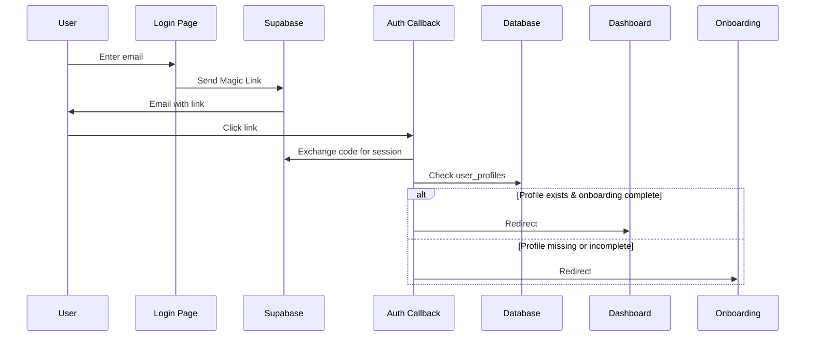

# Authentication & User Management

**Version:** 2.2.0
**Date:** December 27, 2025
**Status:** ✅ Production Ready (Fixed user registration bug)

## Overview

Gastos uses **Supabase Auth** with **Magic Links** for passwordless authentication. All new users go through a 4-step onboarding flow to configure their account.

---

## Table of Contents

1. [Authentication Flow](#authentication-flow)
2. [User Roles & Profiles](#user-roles--profiles)
3. [Magic Links Setup](#magic-links-setup)
4. [Onboarding Flow](#onboarding-flow)
5. [Middleware & Route Protection](#middleware--route-protection)
6. [Database Schema](#database-schema)
7. [API Reference](#api-reference)
8. [Testing](#testing)

---

## Authentication Flow

### 1. Login with Magic Link



### 2. Key Files

- **`app/login/page.tsx`** - Login UI with Magic Link form
- **`lib/auth.ts`** - Authentication functions (signInWithMagicLink)
- **`lib/auth-actions.ts`** - Server Actions for auth
- **`app/auth/callback/route.ts`** - OAuth callback handler

---

## User Roles & Profiles

### User Profile Schema

```typescript
type UserProfile = {
  id: string;                    // UUID (references auth.users.id)
  plan: 'free' | 'pro' | 'plus' | 'admin';  // ENUM type user_plan (subscription tier)
  email: string;                 // User's email (synced from auth.users)
  plan_expires_at?: string;      // Premium/Pro/Plus expiration date
  onboarding_completed: boolean; // Has completed onboarding
  preferences: {
    currency?: 'USD' | 'MXN';
    theme?: 'light' | 'dark' | 'system';
    language?: 'es' | 'en';
  };
  full_name?: string;            // User's full name
  created_at: string;
  updated_at: string;
};
```

**IMPORTANT CHANGE (v2.2.0):**
- Column `role` has been renamed to `plan` and now uses ENUM type `user_plan`
- Added `email` column to store user's email from `auth.users`
- Migration `0001_add_user_plan_enum_and_triggers.sql` handles the data migration automatically

### Plan-Based Features

| Feature | Free | Pro | Plus | Admin |
|---------|------|-----|------|-------|
| Expenses/Incomes | ✅ Unlimited | ✅ Unlimited | ✅ Unlimited | ✅ Unlimited |
| Categories | ✅ Up to 20 | ✅ Up to 50 | ✅ Unlimited | ✅ Unlimited |
| Payment Methods | ✅ 1 method | ✅ 3 methods | ✅ Unlimited | ✅ Unlimited |
| Dashboard Analytics | ✅ Basic | ✅ Advanced | ✅ Advanced + AI | ✅ All features |
| Export Data | ❌ | ✅ CSV | ✅ CSV/Excel/PDF | ✅ All formats |
| Multi-currency | ❌ | ✅ | ✅ | ✅ |
| Family Sharing | ❌ | ❌ | ✅ (Future) | ✅ (Future) |
| Admin Panel | ❌ | ❌ | ❌ | ✅ |

**Default Plan:** All new users start as `'free'` (set by trigger `on_auth_user_created`).

---

## Magic Links Setup

### 1. Supabase Configuration

**Enable Magic Links in Supabase Dashboard:**

1. Go to `Authentication` → `Providers`
2. Enable `Email` provider
3. Enable `Enable email confirmations`
4. Set `Site URL` to your production URL (e.g., `https://gastos.app`)
5. Add redirect URLs:
   - `http://localhost:3000/auth/callback` (development)
   - `https://gastos.app/auth/callback` (production)

### 2. Environment Variables

Add to `.env.local`:

```bash
NEXT_PUBLIC_SITE_URL=http://localhost:3000  # Change for production
SUPABASE_URL=https://your-project.supabase.co
SUPABASE_ANON_KEY=your-anon-key
```

### 3. Email Template Customization

Customize the Magic Link email in Supabase:

**Path:** `Authentication` → `Email Templates` → `Magic Link`

**Suggested Template:**

```html
<h2>¡Bienvenido a Gastos!</h2>
<p>Haz clic en el enlace para iniciar sesión:</p>
<p><a href="{{ .ConfirmationURL }}">Iniciar Sesión</a></p>
<p>Este enlace expira en 1 hora.</p>
```

---

## Onboarding Flow

New users go through a 4-step guided onboarding:

### Step 1: Welcome & Name

- User enters full name
- Name saved to `user_profiles.full_name`
- **File:** `app/onboarding/page.tsx` (step === 1)

### Step 2: Categories

- User selects initial expense categories from 6 suggestions:
  - Alimentos (Green)
  - Transporte (Blue)
  - Entretenimiento (Amber)
  - Servicios (Purple)
  - Salud (Red)
  - Educación (Indigo)
- Selected categories created in `categories` table
- **Minimum:** 1 category required

### Step 3: Payment Method

- User adds first payment method
- Choose type: Credit Card, Debit Card, or Cash
- Automatically set as default
- **Required:** Name field

### Step 4: Completion

- Summary of setup
- Quick tips for using the app
- Button to complete onboarding and go to dashboard

### Skipping Onboarding

Users can click "Saltar configuración" to skip to step 4, but:
- Still need to complete onboarding to access dashboard
- Can skip categories/payment method steps

---

## Middleware & Route Protection

### Protected Routes

**File:** `lib/supabase/middleware.ts`

```typescript
// 1. Unauthenticated users → Redirect to /login
if (!user && pathname.startsWith('/dashboard')) {
  redirect('/login');
}

// 2. Authenticated users without profile/onboarding → Redirect to /onboarding
if (user && !profile?.onboarding_completed) {
  redirect('/onboarding');
}

// 3. Authenticated users with completed onboarding → Access granted
```

### Public Routes

- `/login` - Login page
- `/auth/callback` - OAuth callback (required for Magic Links)
- Public assets (images, favicon, etc.)

### Onboarding-Protected Routes

- `/onboarding` - Requires authentication but not onboarding completion

### Dashboard-Protected Routes

- `/dashboard/*` - Requires authentication AND completed onboarding

---

## Database Schema

### Table: `user_profiles`

**Schema:** `lib/drizzle/schema.ts`
**Migration:** `lib/drizzle/migrations/0001_add_user_plan_enum_and_triggers.sql`

```sql
-- ENUM type for user plans
CREATE TYPE "public"."user_plan" AS ENUM ('free', 'pro', 'plus', 'admin');

-- user_profiles table
CREATE TABLE user_profiles (
  id UUID PRIMARY KEY REFERENCES auth.users(id) ON DELETE CASCADE,
  plan "public"."user_plan" NOT NULL DEFAULT 'free'::"public"."user_plan",
  email TEXT,
  plan_expires_at TIMESTAMPTZ,
  onboarding_completed BOOLEAN NOT NULL DEFAULT false,
  preferences JSONB NOT NULL DEFAULT '{"currency": "USD", "theme": "system"}',
  full_name TEXT,
  created_at TIMESTAMPTZ NOT NULL DEFAULT now(),
  updated_at TIMESTAMPTZ NOT NULL DEFAULT now()
);

-- Indexes
CREATE INDEX idx_user_profiles_plan ON user_profiles(plan);
CREATE INDEX idx_user_profiles_email ON user_profiles(email);
CREATE INDEX idx_user_profiles_onboarding_completed ON user_profiles(onboarding_completed);

-- RLS Policies
ALTER TABLE user_profiles ENABLE ROW LEVEL SECURITY;

CREATE POLICY "Users can view own profile"
  ON user_profiles FOR SELECT USING (auth.uid() = id);

CREATE POLICY "Users can update own profile"
  ON user_profiles FOR UPDATE USING (auth.uid() = id);

CREATE POLICY "Users can insert own profile"
  ON user_profiles FOR INSERT WITH CHECK (auth.uid() = id);
```

### Automatic Profile Creation

**Migration:** `lib/drizzle/migrations/0001_add_user_plan_enum_and_triggers.sql`

Automatically creates `user_profile` when a new user signs up via the `on_auth_user_created` trigger.

**Function:**
```sql
CREATE OR REPLACE FUNCTION "public"."handle_new_user"()
RETURNS trigger
LANGUAGE plpgsql
SECURITY DEFINER
SET search_path = 'public'
AS $$
BEGIN
  INSERT INTO "public"."user_profiles" (
    "id",
    "email",
    "full_name",
    "plan",
    "created_at",
    "updated_at"
  )
  VALUES (
    NEW.id,
    NEW.email,
    COALESCE(NEW.raw_user_meta_data->>'full_name', ''),
    'free'::"public"."user_plan",
    now(),
    now()
  )
  ON CONFLICT ("id") DO UPDATE SET
    "email" = EXCLUDED."email",
    "full_name" = COALESCE(EXCLUDED."full_name", "user_profiles"."full_name"),
    "updated_at" = now();

  RETURN NEW;
END;
$$;
```

**Trigger:**
```sql
CREATE TRIGGER "on_auth_user_created"
  AFTER INSERT ON "auth"."users"
  FOR EACH ROW
  EXECUTE FUNCTION "public"."handle_new_user"();
```

**IMPORTANT:** This trigger is included in the Drizzle migration `0001_add_user_plan_enum_and_triggers.sql` and is applied automatically when running `pnpm db:migrate`.

---

## API Reference

### Authentication Functions

**File:** `lib/auth.ts`

```typescript
// Send Magic Link to email
signInWithMagicLink(email: string, redirectTo?: string)
  → { success: true } | { error: string }

// Sign in with password (fallback)
signIn(email: string, password: string)
  → { user: User } | { error: string }

// Sign up with password (fallback)
signUp(email: string, password: string)
  → { user: User } | { error: string }

// Sign out
signOut()
  → { success: true } | { error: string }

// Get current user (server-side)
getUser()
  → User | null
```

### User Profile Queries

**File:** `lib/db.ts`

```typescript
// Get user profile by ID
getUserProfile(userId: string)
  → UserProfile | null

// Create user profile
createUserProfile(profile: InsertUserProfile)
  → UserProfile

// Update user profile
updateUserProfile(userId: string, updates: Partial<InsertUserProfile>)
  → UserProfile

// Mark onboarding as complete
completeOnboarding(userId: string)
  → UserProfile
```

### Server Actions

**File:** `app/dashboard/actions.ts`

```typescript
// Save user's name during onboarding
saveOnboardingName(formData: FormData)
  → ActionResult

// Complete onboarding flow
finishOnboarding()
  → ActionResult
```

**File:** `lib/auth-actions.ts`

```typescript
// Send Magic Link (client-callable)
signInWithMagicLink(email: string)
  → { success: true } | { error: string }
```

---

## Testing

### Manual Testing Checklist

**1. Magic Link Flow:**

- [ ] Enter email on `/login`
- [ ] Check email inbox for Magic Link
- [ ] Click link in email
- [ ] Verify redirect to `/onboarding` (new user)
- [ ] Verify redirect to `/dashboard` (existing user)

**2. Onboarding Flow:**

- [ ] Complete Step 1: Enter name
- [ ] Complete Step 2: Select at least 1 category
- [ ] Complete Step 3: Add payment method
- [ ] Reach Step 4: See summary
- [ ] Click "Ir al Dashboard"
- [ ] Verify redirect to `/dashboard`
- [ ] Verify `onboarding_completed = true` in database

**3. Middleware Protection:**

- [ ] Try accessing `/dashboard` without auth → Redirects to `/login`
- [ ] Try accessing `/onboarding` without auth → Redirects to `/login`
- [ ] Try accessing `/onboarding` with completed onboarding → Redirects to `/dashboard`
- [ ] Try accessing `/dashboard` without completed onboarding → Redirects to `/onboarding`

**4. Skip Onboarding:**

- [ ] Click "Saltar configuración" during onboarding
- [ ] Verify redirect to Step 4
- [ ] Click "Ir al Dashboard"
- [ ] Verify access to dashboard (even with no categories/payment methods)

### Database Verification

```sql
-- Check user profile
SELECT * FROM user_profiles WHERE id = 'user-id-here';

-- Verify trigger creates profile for new users
SELECT COUNT(*) FROM user_profiles;
SELECT COUNT(*) FROM auth.users;
-- Both should match

-- Check onboarding status
SELECT id, full_name, onboarding_completed, role
FROM user_profiles
ORDER BY created_at DESC
LIMIT 10;
```

### Common Issues

**Issue:** Magic Link email not received

**Solution:**
- Check Supabase email settings
- Verify `NEXT_PUBLIC_SITE_URL` in `.env.local`
- Check spam folder
- Verify email provider allows Supabase emails

**Issue:** Redirect loop after login

**Solution:**
- Check `user_profiles` table exists
- Verify trigger `on_auth_user_created` is created
- Check RLS policies are enabled
- Verify `onboarding_completed` field exists

**Issue:** "Profile not found" error

**Solution:**
- Ensure migration `0001_add_user_plan_enum_and_triggers.sql` has been applied
- Run `pnpm db:migrate` to apply missing migrations
- Verify trigger exists: `SELECT * FROM information_schema.triggers WHERE trigger_name = 'on_auth_user_created';`
- Create profile manually (emergency): `INSERT INTO user_profiles (id, plan, onboarding_completed) VALUES ('user-id', 'free'::"public"."user_plan", false);`

---

## Future Enhancements

### Planned Features

1. **OAuth Providers:**
   - Google Sign-In
   - GitHub Sign-In
   - Apple Sign-In

2. **Premium Tier Management:**
   - Subscription payment flow
   - Plan expiration handling
   - Feature gating based on role

3. **Enhanced Onboarding:**
   - Import expenses from CSV
   - Connect bank accounts (future)
   - Budget setup wizard

4. **Profile Management:**
   - Edit profile page
   - Change email
   - Delete account

---

## Related Documentation

- [Migration Guide](./deployment/MIGRATION-GUIDE.md) - **CRITICAL**: How to apply the user registration fix migration
- [Database Setup Guide](./setup/SUPABASE.md)
- [Deployment Guide](./deployment/DEPLOYMENT.md) - Production deployment with automatic migrations
- [Design System](./design/design-system.md)
- [Component Guide](./COMPONENT_GUIDE.md)
- [Accessibility Audit](./ACCESSIBILITY-COMPLIANCE.md)

---

**Last Updated:** December 27, 2025
**Maintained by:** Gastos Development Team

---

## Changelog

### v2.2.0 (December 27, 2025)
- **CRITICAL FIX:** Fixed user registration bug ("type user_plan does not exist")
- Migrated `role` column to `plan` with ENUM type `user_plan`
- Added `email` column to `user_profiles`
- Updated `handle_new_user()` function to use correct ENUM syntax
- Migration `0001_add_user_plan_enum_and_triggers.sql` handles all changes automatically

### v2.1.0 (December 26, 2025)
- Documentation audit and updates
- Removed obsolete NextAuth references
- Updated environment variables
